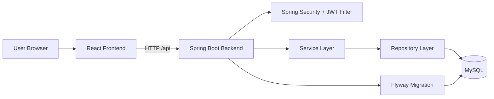
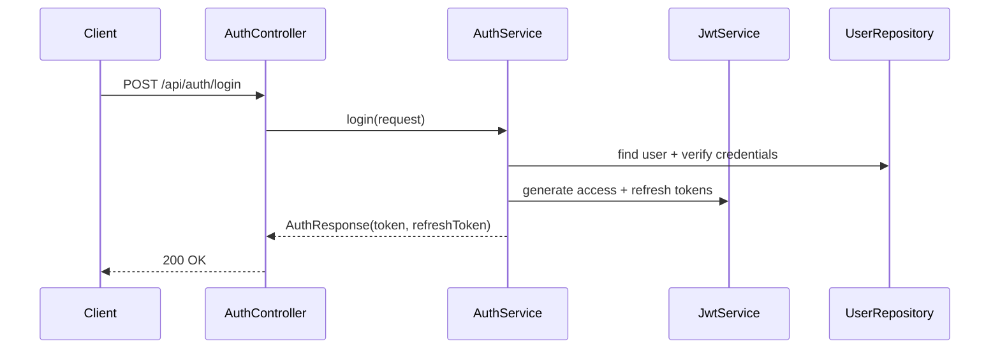
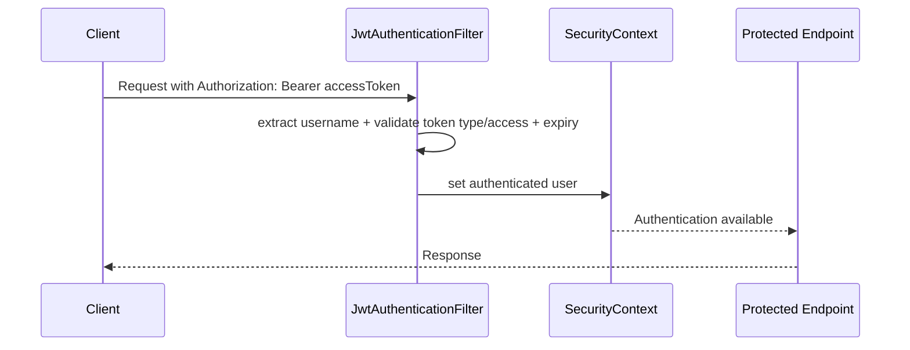
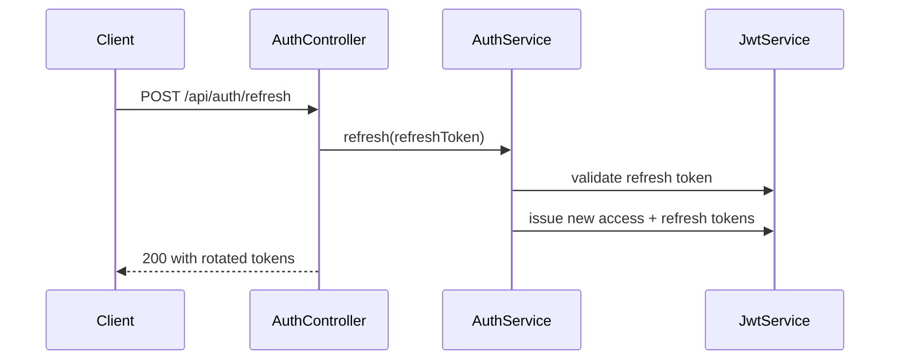
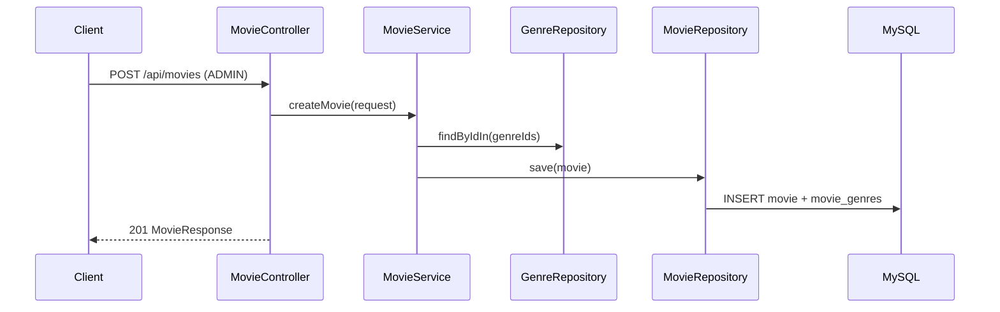
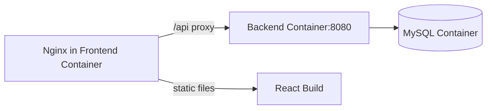

# Architecture and Request Flow

## High-Level Architecture

## Backend Layering

- Controller layer:
  - Receives HTTP requests and validates DTOs.
  - Uses authenticated principal from Spring Security.
- Service layer:
  - Applies business rules (ownership, role checks, soft-delete logic).
  - Coordinates entity mapping and repository calls.
- Repository layer:
  - Executes database queries via Spring Data JPA.
- Database layer:
  - MySQL schema managed by Flyway migrations.

## Authentication Flow

### Access Request Flow

### Refresh Token Flow

## Movie and Genre Flow

## Review Ownership Rules

- `USER` can create/update/delete only their own review.
- `ADMIN` can delete any review.
- Attempt to update another user's review returns `403`.

## Rating Rules

- One rating per user per movie.
- `PUT /movies/{id}/rating` inserts or updates existing rating.
- `DELETE /movies/{id}/rating` removes current user's rating.

## Pagination

- Movies: `GET /api/movies?page=&size=&search=&genreId=`
- Reviews: `GET /api/movies/{movieId}/reviews?page=&size=`

## Deployment Topology (Docker Compose)

## Security Notes

- JWT secret and DB credentials come from environment variables.
- CORS origins are environment-driven (`CORS_ALLOWED_ORIGINS`).
- In production, set only trusted frontend domain(s).

